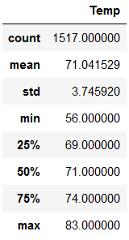
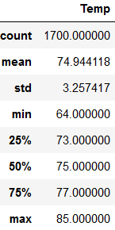

# Surfs-Up Temperature Analysis

## Overview
Analyzing temperature data collected from recent years to gain insight on if the business should transition to a year-round business model.

## Results

December Temperature Summary     |   June Temperature Summary
:------------------------:|:---------------------:
 | 

* The average temperature in December is around 3 degrees lower than June's average.
* Each quartile also has a temperature 3 degrees lower then the relative quartile in June.
* The largest difference between December and June is the low temperature observed for each. With December's being 8 degrees less than June's low.

## Summary
From the queries performed it appears that the business could move forward with analyzing the benefit of a year round business plan. December is only marginally cooler then June on average, and this marginal difference likely wouldn't have a major effect on business. If we were to continue to analyze temperature data I would reccomend we start by adding analysis for January and February, as well as a couple months from the summer.
